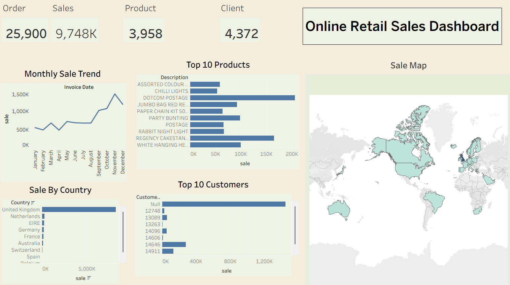

# 🛒 Online Retail Sales Dashboard

An interactive **Tableau Dashboard** built using the **Online Retail Dataset** to analyze sales performance, customer behavior, product performance, and country-wise sales.

---

## 📌 Project Overview

This project transforms raw online retail transaction data into an interactive dashboard that helps businesses monitor sales performance and make data-driven decisions.

The dashboard provides insights into:

- Total Orders
- Total Sales
- Total Products
- Total Customers
- Monthly Sales Trends
- Top Selling Products
- Top Customers
- Country-wise Sales
- Global Sales Distribution

---

## 📊 Dashboard Preview



---

## 📈 Key Performance Indicators (KPIs)

- 📦 Total Orders
- 💰 Total Sales
- 📦 Total Products
- 👥 Total Customers

---

## 📊 Dashboard Features

### 📅 Monthly Sales Trend
- Analyze monthly sales performance.
- Identify seasonal trends and growth.

### 🏆 Top 10 Products
- Discover the highest-selling products.
- Support inventory and marketing decisions.

### 👥 Top 10 Customers
- Identify the most valuable customers.
- Understand customer purchasing behavior.

### 🌍 Sales by Country
- Compare sales across different countries.
- Identify top-performing markets.

### 🗺️ Sales Map
- Visualize worldwide sales distribution using an interactive map.

---

## 💡 Business Insights

- The United Kingdom generates the highest sales.
- Sales increase significantly during the final months of the year.
- A small number of products contribute a large share of total revenue.
- Top customers account for a significant portion of sales.
- International markets present opportunities for business growth.

---

## 🛠️ Tools Used

- Tableau Public


---

## 📂 Dataset

The dataset contains:

- Invoice Number
- Product Description
- Quantity
- Invoice Date
- Unit Price
- Customer ID
- Country

---

## 📁 Project Structure

```
Online-Retail-Sales-Dashboard/
│
├── Dashboard.png
├── Book1.twb
├── online_retail.csv
└── README.md
```

---

## 🚀 Skills Demonstrated

- Data Visualization
- Dashboard Design
- Business Intelligence
- KPI Reporting
- Sales Analytics
- Customer Analytics
- Data Storytelling
- Tableau

---

## ⭐ Future Improvements

- Profit Analysis
- Customer Segmentation
- Product Category Analysis
- Forecasting Dashboard
- Dynamic Filters
- Year-over-Year Comparison

---


## 👩‍💻 Author

**Mahek Nandwana**

Aspiring Data Analyst | Tableau | Power BI | SQL | Python

---

⭐ If you found this project useful, consider giving it a **Star** on GitHub!
